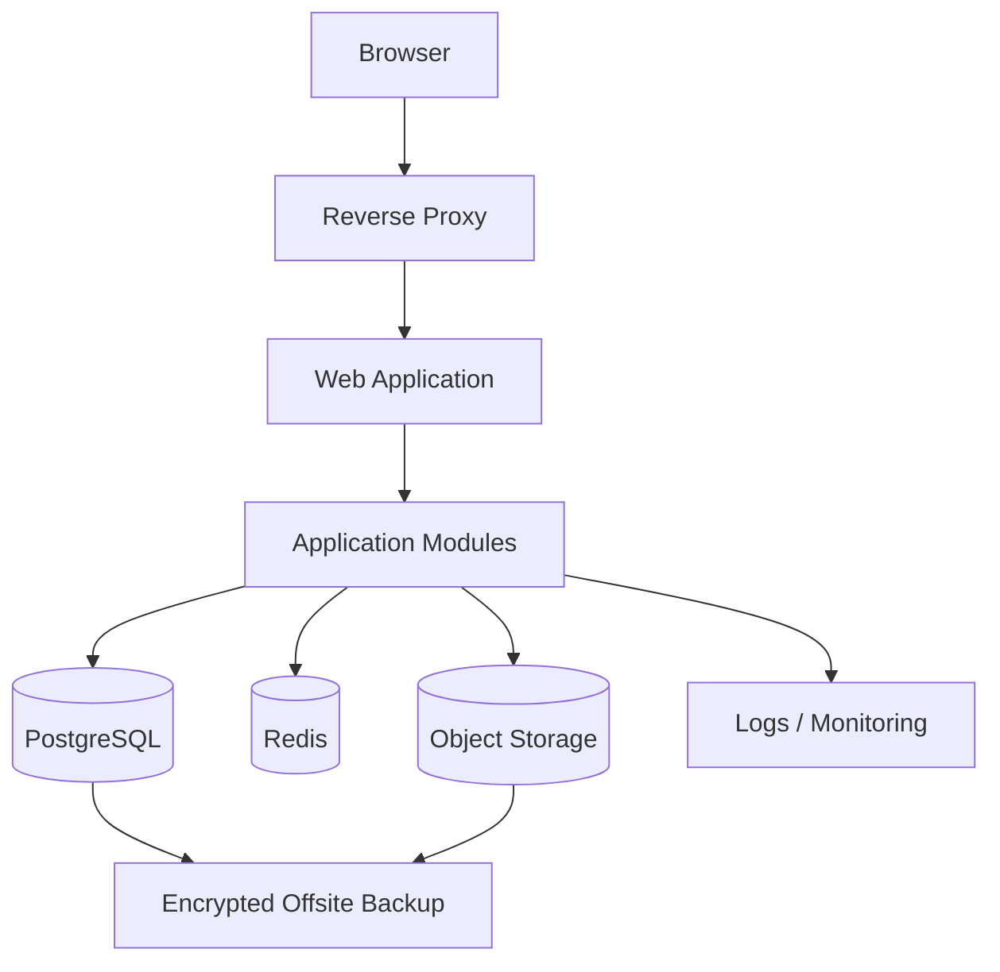

# 04 — ARCHITECTURE & TECH STACK: YAYASAN ISLAM QUDWATUL UMMAH LEBAK

## 1. Daftar Isi
1. Executive Decision
2. Architecture Principles
3. Workload Assumptions
4. Topology
5. Application Modules
6. Recommended Tech Stack
7. Data Architecture
8. Accounting Architecture
9. API & Integration
10. Security Architecture
11. Storage
12. Deployment
13. Backup & DR
14. Observability
15. Scaling
16. ADR
17. Prohibited/Deferred Choices
18. Implementation Order
19. Verification Notes

## 2. Executive Decision
### Rekomendasi utama
**Modular Monolith + PostgreSQL + Redis + Object Storage**, dideploy pada VPS/VM dengan containerization.

Alasan: domain accounting sangat konsisten dan transaction-heavy; organisasi multi-unit tetapi belum menunjukkan kebutuhan ownership/deployment isolation yang membenarkan microservices. Modular monolith menjaga transaction boundary dan memperkecil operational overhead.

### Trade-off
Kelebihan: sederhana dioperasikan, transaksi lintas modul lebih mudah, debugging lebih mudah, biaya lebih terkendali.
Kekurangan: deployment masih satu aplikasi dan perlu disiplin boundary modul.

### Alternatif
1. **Monolith full-stack server-rendered** bila tim sangat kecil.
2. **Service decomposition bertahap** hanya setelah traffic, ownership, atau isolation membuktikan kebutuhan.

## 3. Architecture Principles
- Accounting invariant first.
- Database sebagai source of truth.
- Immutable posted transaction.
- Configuration-driven reporting.
- Least privilege.
- API/domain boundary jelas.
- Observability by default.
- No premature microservices.

## 4. Workload Assumptions
- Pengguna internal multi-unit.
- Transaksi harian/periodik, bukan high-frequency consumer traffic.
- Banyak dokumen evidence.
- Laporan periodik dapat menghasilkan query berat.
- Konsistensi transaksi lebih penting daripada distributed scalability.

## 5. Topology


## 6. Application Modules
- Identity & Access
- Organization & Unit
- Accounting Core
- Cash & Bank
- Fund Management
- Budgeting
- Student Billing
- BOS/BOSDA
- Procurement/Expense
- Fixed Asset
- Approval
- Document
- Reporting
- Audit
- System Configuration

## 7. Recommended Tech Stack
| Layer | Rekomendasi | Alasan |
|---|---|---|
| Frontend | Next.js + TypeScript | web admin modern, typed, responsive |
| Backend | Laravel + PHP | kuat untuk business CRUD, validation, queue, auth, reporting-oriented apps |
| Database | PostgreSQL | relational consistency, reporting, constraints |
| Cache/Queue | Redis | queue dan cache |
| Object Storage | S3-compatible | evidence/file besar |
| Reverse Proxy | Nginx/Caddy | TLS dan routing |
| Containers | Docker Compose | reproducible deployment pada VPS |
| CI/CD | GitHub Actions | automated quality/release pipeline |
| Monitoring | structured logs + error monitoring; metrics bertahap | sesuai skala awal |

> Catatan: versi package/framework harus dikunci saat implementation kickoff berdasarkan dokumentasi resmi terkini.

## 8. Data Architecture
Primary DB PostgreSQL. Gunakan numeric/decimal untuk uang. Foreign key, unique constraint, check constraint, dan transaction boundary wajib digunakan.

Core tables:
organization, units, users, roles, permissions, fiscal_years, accounting_periods, fund_sources, chart_of_accounts, journal_entries, journal_lines, cash_accounts, bank_accounts, bank_transactions, bank_reconciliations, budgets, budget_lines, students, student_accounts, student_invoices, student_payments, vendors, expenses, fixed_assets, asset_depreciations, documents, attachments, approvals, audit_logs, report_templates, report_mappings.

## 9. Accounting Architecture
JournalEntry header + JournalLine detail.
Invariant:
`SUM(debit) = SUM(credit)` untuk setiap posted entry.

Transaction posting harus atomik. Period lock mencegah posting biasa. Reversal menghasilkan entry baru yang mengoreksi entry asal.

Reporting chain:
`COA -> Accounting Mapping -> Reporting Mapping -> Report Template`.

## 10. API & Integration
API/domain service harus idempotent untuk command yang berpotensi diulang. External webhook bila digunakan wajib signed dan idempotent. Tidak ada integrasi bank/payment gateway yang diasumsikan sudah tersedia.

## 11. Security Architecture
- RBAC + unit/fund scope.
- Password hashing.
- Session protection.
- CSRF untuk browser flows.
- Input validation.
- Rate limiting.
- Secure headers.
- Secret management via environment/secret store.
- Audit event untuk perubahan sensitif.
- Encryption in transit.
- Backup encryption.

## 12. Storage
Database untuk structured data. Object storage untuk PDF, scan, receipt, attachment besar. Metadata file disimpan di DB. File access melalui authorization check.

## 13. Deployment
```text
Internet
  -> TLS Reverse Proxy
  -> Web/API Container
  -> PostgreSQL
  -> Redis
  -> Object Storage
```
Pisahkan network internal database/cache dari public ingress.

## 14. Backup & DR
- Daily full DB backup.
- Incremental/WAL strategy sesuai kebutuhan.
- Object storage versioning/backup.
- Offsite copy.
- Restore test terjadwal.
- Recovery procedure terdokumentasi.
- Target RPO/RTO dikonfirmasi bersama yayasan sebelum production SLA ditetapkan.

## 15. Observability
Log terstruktur dengan correlation/request ID. Pantau error rate, latency, DB health, queue failures, disk, backup status, authentication failures, dan accounting posting failures.

## 16. Scaling
Tahap 1: vertical scaling VPS.
Tahap 2: separate worker, object storage, read/report workload optimization.
Tahap 3: read replica/reporting database bila terbukti perlu.
Microservices bukan target default.

## 17. ADR
- ADR-001 Modular monolith.
- ADR-002 PostgreSQL.
- ADR-003 Decimal monetary values.
- ADR-004 Immutable posted transactions.
- ADR-005 Object storage for evidence.
- ADR-006 Mapping-driven reports.
- ADR-007 Queue for asynchronous work.

## 18. Prohibited/Deferred Choices
- Jangan memakai float untuk uang.
- Jangan hard-delete posted journal.
- Jangan menaruh file besar di database sebagai default.
- Jangan memakai microservices tanpa ownership/scale justification.
- Jangan hardcode laporan keuangan tanpa mapping layer.
- Jangan membuat definisi IKS/ISB sendiri.

## 19. Implementation Order
Foundation -> Auth/RBAC -> Master Data -> Accounting Core -> Cash/Bank -> Fund -> Budget -> SPP/IBL -> BOS/BOSDA -> Fixed Asset -> Approval -> Reporting -> Audit -> UAT.

## 20. Verification Notes
Pemilihan stack di atas adalah architectural recommendation. Versi framework/package, provider limits, pricing, dan detail deployment harus diverifikasi dari dokumentasi resmi pada kickoff implementasi.
