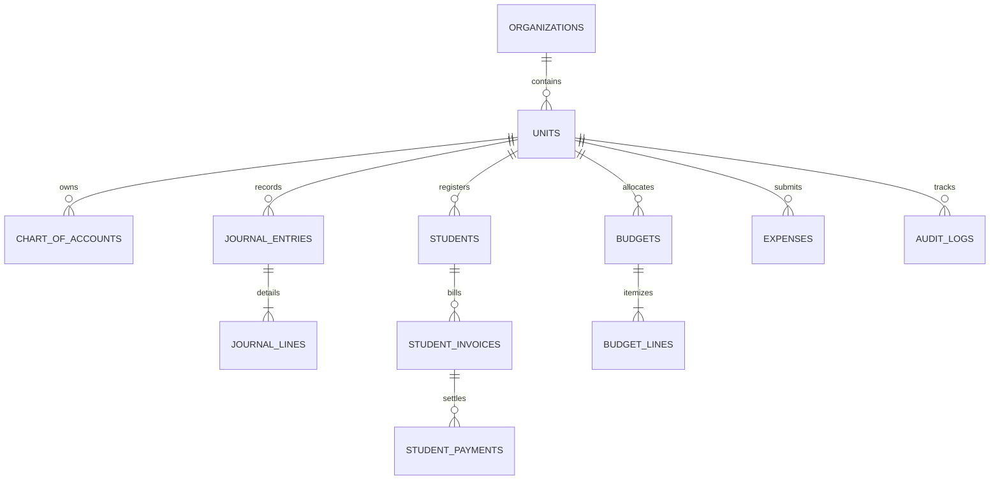

# 09 — FIREBASE ARCHITECTURE, DATABASE SETUP & DEPLOYMENT GUIDE
## SISTEM INFORMASI KEUANGAN & AKUNTANSI YAYASAN ISLAM QUDWATUL UMMAH LEBAK

---

## 1. Analisis & Roadmap Proyek Berbasis Firebase

### 1.1 Analisis Kebutuhan Sistem
Yayasan Islam Qudwatul Ummah Lebak menaungi multi-unit (TK, SD, SMP, SMA, Pondok/Boarding, Kantor Yayasan) dengan 8 pilar sumber dana utama:
1. **INPAK Pendidikan** (Infaq Pengembangan & Aktivitas Pendidikan)
2. **IKS** (Iuran Kegiatan Siswa)
3. **ISB** (Iuran Sarana Belajar)
4. **SPP** (Sumbangan Pembinaan Pendidikan - tagihan bulanan)
5. **IBL** (Iuran Belajar Lembaga / Asrama)
6. **BOS** (Bantuan Operasional Sekolah Pusat)
7. **BOSDA** (Bantuan Operasional Sekolah Daerah)
8. **Sodaqoh / ZISWAF** (Penerimaan umum yayasan)

### 1.2 Penyesuaian Arsitektur: PostgreSQL ke Cloud Firebase
Dalam dokumen awal arsitektur modular monolith diusulkan menggunakan PostgreSQL. Sesuai instruksi resmi: **Database dialihkan 100% ke ekosistem Firebase**.
Berikut adalah pemetaan komponen arsitektur baru:

| Komponen Sistem | Layanan Firebase | Fungsi Utama |
|---|---|---|
| **Database Transaksional** | **Cloud Firestore** | NoSQL Document Store dengan dukungan ACID Transaction & Batched Writes untuk pencatatan Jurnal, Master Data, Tagihan, & Anggaran. |
| **Authentication & RBAC** | **Firebase Auth + Custom Claims** | Autentikasi aman (Email/Password, Multi-Factor) dengan RBAC berbasis token claims (`role`, `unit_id`, `permissions`). |
| **Penyimpanan Berkas Bukti** | **Cloud Storage for Firebase** | Arsip berkas nota belanja BOS/BOSDA, kuitansi penerimaan, bukti transfer SPP, scan dokumen legalitas. |
| **Accounting Engine & API** | **Cloud Functions (Node.js/TypeScript v2)** | Penjamin invariant akuntansi: validasi `SUM(debit) == SUM(credit)`, posting transaksi atomik, period lock, & webhook. |
| **Frontend Web Hosting** | **Firebase Hosting (Next.js / Vite SPA)** | CDN global berkecepatan tinggi dengan sertifikat SSL gratis otomatis, integrasi custom domain yayasan. |
| **Backup Otomatis (DR)** | **Cloud Firestore Scheduled Export** | Backup data harian terjadwal ke Google Cloud Storage bucket terisolasi. |

---

## 2. Struktur Desain Database Cloud Firestore (Schema Design)

Cloud Firestore adalah NoSQL document database. Agar integritas akuntansi double-entry dan query pelaporan multi-unit tetap cepat serta konsisten, kita menggunakan model **Normalized-Transactional & Subcollections**.

### 2.1 Struktur Koleksi (Root Collections)



#### A. Koleksi `units` (Unit Kerja / Lembaga)
Document ID: `unit_id` (contoh: `yayasan-pusat`, `sdit-qudwah`, `smpit-qudwah`, `smait-qudwah`, `boarding`)
```json
{
  "id": "sdit-qudwah",
  "name": "SDIT Qudwatul Ummah",
  "code": "SDIT",
  "level": "SD",
  "isActive": true,
  "headmaster": "Nama Kepala Sekolah",
  "treasurer": "Nama Bendahara",
  "contactPhone": "08123456789",
  "createdAt": "TIMESTAMP",
  "updatedAt": "TIMESTAMP"
}
```

#### B. Koleksi `fund_sources` (Sumber Dana)
Document ID: `fund_id` (contoh: `SPP`, `BOS`, `BOSDA`, `INPAK`, `IKS`, `ISB`, `IBL`, `SODAQOH`)
```json
{
  "id": "BOS",
  "code": "BOS-NAS",
  "name": "Bantuan Operasional Sekolah (Pusat)",
  "category": "PEMERINTAH",
  "isRestricted": true,
  "requiresEvidence": true,
  "createdAt": "TIMESTAMP"
}
```

#### C. Koleksi `fiscal_periods` (Tahun & Periode Pembukuan)
Document ID: `2026-09` (Format: `YYYY-MM`)
```json
{
  "id": "2026-09",
  "fiscalYear": 2026,
  "month": 9,
  "startDate": "2026-09-01T00:00:00Z",
  "endDate": "2026-09-30T23:59:59Z",
  "isClosed": false,
  "closedAt": null,
  "closedBy": null
}
```

#### D. Koleksi `chart_of_accounts` (Bagan Akun Standar / COA)
Document ID: `account_code` (contoh: `110101`, `410101`)
```json
{
  "id": "110101",
  "code": "110101",
  "name": "Kas Operasional SDIT",
  "unitId": "sdit-qudwah",
  "category": "ASSET",
  "subCategory": "CURRENT_ASSET",
  "normalBalance": "DEBIT",
  "level": 3,
  "parentId": "110100",
  "currentBalance": 15500000.00,
  "isActive": true,
  "createdAt": "TIMESTAMP",
  "updatedAt": "TIMESTAMP"
}
```

#### E. Koleksi `journal_entries` & Subkoleksi `lines` (Core Akuntansi Double-Entry)
Document ID: `journal_id` (contoh: `JV-202609-00012`)
```json
// journal_entries/JV-202609-00012
{
  "id": "JV-202609-00012",
  "entryNumber": "JV/SDIT/2026/09/0012",
  "date": "2026-09-25T10:00:00Z",
  "periodId": "2026-09",
  "unitId": "sdit-qudwah",
  "fundSourceId": "BOS",
  "sourceDocument": "EXP-BOS-2026-004",
  "description": "Pembelian ATK Kegiatan Asesmen BOS Tahap II",
  "status": "POSTED",
  "totalDebit": 2450000.00,
  "totalCredit": 2450000.00,
  "isBalanced": true,
  "isReversal": false,
  "reversedEntryId": null,
  "postedAt": "TIMESTAMP",
  "postedBy": "uid_bendahara_sdit",
  "evidenceUrls": [
    "https://firebasestorage.googleapis.com/.../nota_atk_01.jpg"
  ],
  "createdAt": "TIMESTAMP"
}
```
**Subkoleksi:** `journal_entries/JV-202609-00012/lines/{line_id}`
```json
// Line 1: Beban ATK (Debit)
{
  "lineId": "1",
  "accountCode": "510201",
  "accountName": "Beban ATK & Penggandaan",
  "debit": 2450000.00,
  "credit": 0.00,
  "unitId": "sdit-qudwah",
  "fundSourceId": "BOS",
  "memo": "Kertas HVS 5 rim dan spidol"
}

// Line 2: Kas Operasional (Credit)
{
  "lineId": "2",
  "accountCode": "110101",
  "accountName": "Kas Operasional SDIT",
  "debit": 0.00,
  "credit": 2450000.00,
  "unitId": "sdit-qudwah",
  "fundSourceId": "BOS",
  "memo": "Kas keluar belanja ATK"
}
```

#### F. Koleksi `students`, `student_invoices`, & `student_payments` (SPP & IBL)
```json
// student_invoices/INV-202609-00105
{
  "id": "INV-202609-00105",
  "invoiceNumber": "SPP/2026/09/0105",
  "studentId": "STD-0982",
  "studentName": "Ahmad Fauzi",
  "unitId": "smpit-qudwah",
  "classGrade": "8A",
  "billingMonth": "2026-09",
  "items": [
    { "type": "SPP", "amount": 450000 },
    { "type": "IBL_ASRAMA", "amount": 600000 },
    { "type": "IKS", "amount": 50000 }
  ],
  "totalAmount": 1100000.00,
  "paidAmount": 1100000.00,
  "status": "PAID",
  "dueDate": "2026-09-10",
  "paidAt": "2026-09-08T14:20:00Z",
  "receiptJournalId": "JV-202609-00045"
}
```

#### G. Koleksi `budgets` & `budget_lines` (BOS, BOSDA, Operasional)
Dokumen anggaran per unit per tahun anggaran dengan pagu vs realisasi riil.

#### H. Koleksi `audit_logs` (Jejak Rekam Immutable)
```json
{
  "id": "AUDIT-992138",
  "timestamp": "TIMESTAMP",
  "userId": "uid_admin",
  "userName": "Ustadz Hidayat",
  "action": "POST_JOURNAL",
  "entity": "journal_entries",
  "entityId": "JV-202609-00012",
  "unitId": "sdit-qudwah",
  "ipAddress": "180.245.xx.xx",
  "userAgent": "Mozilla/5.0 ...",
  "details": {
    "totalAmount": 2450000.00,
    "description": "Posting jurnal BOS ATK"
  }
}
```

---

## 3. Aturan Keamanan & Integritas (Security Rules)

### 3.1 Cloud Firestore Security Rules (`firestore.rules`)
Menjamin:
1. Tidak ada transaksi yang bisa diposting jika tidak seimbang (`totalDebit == totalCredit`).
2. Transaksi yang statusnya `POSTED` bersifat **immutable** (tidak boleh diupdate atau dihapus lewat client-side).
3. Transaksi pada periode yang sudah terkunci (`isClosed == true`) diblokir total.
4. Akses data dibatasi sesuai `unitId` di Custom Claims user.

```javascript
rules_version = '2';
service cloud.firestore {
  match /databases/{database}/documents {

    // Helper functions
    function isAuthenticated() {
      return request.auth != null;
    }
    
    function getUserRole() {
      return request.auth.token.role;
    }
    
    function getUserUnit() {
      return request.auth.token.unitId;
    }
    
    function isSuperAdmin() {
      return isAuthenticated() && getUserRole() == 'SUPER_ADMIN';
    }
    
    function isYayasanLeader() {
      return isAuthenticated() && (getUserRole() == 'PIMPINAN_YAYASAN' || isSuperAdmin());
    }

    function canAccessUnit(unitId) {
      return isYayasanLeader() || getUserUnit() == unitId;
    }

    // Units
    match /units/{unitId} {
      allow read: if isAuthenticated();
      allow write: if isSuperAdmin();
    }

    // Chart of Accounts
    match /chart_of_accounts/{accountId} {
      allow read: if isAuthenticated();
      allow write: if isSuperAdmin() || (isAuthenticated() && getUserRole() == 'KEUANGAN');
    }

    // Fiscal Periods
    match /fiscal_periods/{periodId} {
      allow read: if isAuthenticated();
      allow write: if isSuperAdmin() || (isAuthenticated() && getUserRole() == 'KEUANGAN');
    }

    // Journal Entries (Double-Entry Core)
    match /journal_entries/{journalId} {
      allow read: if isAuthenticated() && canAccessUnit(resource.data.unitId);
      
      // Creating draft / posting
      allow create: if isAuthenticated() && canAccessUnit(request.resource.data.unitId)
        && request.resource.data.totalDebit == request.resource.data.totalCredit
        && request.resource.data.totalDebit > 0;

      // Update: Dilarang mengubah jika transaksi sudah POSTED
      allow update: if isAuthenticated() && canAccessUnit(resource.data.unitId)
        && resource.data.status != 'POSTED'
        && request.resource.data.totalDebit == request.resource.data.totalCredit;

      // Dilarang menghapus journal entry yang sudah POSTED
      allow delete: if isAuthenticated() && resource.data.status == 'DRAFT' && canAccessUnit(resource.data.unitId);

      // Subkoleksi Lines
      match /lines/{lineId} {
        allow read: if isAuthenticated();
        allow write: if isAuthenticated() && get(/databases/$(database)/documents/journal_entries/$(journalId)).data.status != 'POSTED';
      }
    }

    // Student Invoices & Payments
    match /student_invoices/{invoiceId} {
      allow read: if isAuthenticated() && canAccessUnit(resource.data.unitId);
      allow write: if isAuthenticated() && (getUserRole() == 'OPERATOR_SPP' || getUserRole() == 'KEUANGAN' || isSuperAdmin());
    }

    // Audit Logs (Write-Only Append, Never Edit/Delete)
    match /audit_logs/{logId} {
      allow read: if isYayasanLeader() || getUserRole() == 'AUDITOR';
      allow create: if isAuthenticated();
      allow update, delete: if false; // Strict Immutable!
    }
  }
}
```

### 3.2 Firebase Storage Security Rules (`storage.rules`)
Menjamin bukti transaksi (nota, invoice, kwitansi) terisolasi dan hanya dapat diunggah oleh staf yang berhak:

```javascript
rules_version = '2';
service firebase.storage {
  match /b/{bucket}/o {
    
    function isAuthenticated() {
      return request.auth != null;
    }
    
    function isStaff() {
      return isAuthenticated() && (
        request.auth.token.role in ['BENDAHARA', 'KEUANGAN', 'OPERATOR_SPP', 'SUPER_ADMIN', 'PIMPINAN_YAYASAN']
      );
    }

    // Bukti Transaksi Pengeluaran / Nota Belanja BOS
    match /evidence/{unitId}/{year}/{fileName} {
      allow read: if isAuthenticated();
      allow write: if isStaff() 
        && request.resource.size < 10 * 1024 * 1024 // Max 10MB
        && request.resource.contentType.matches('image/.*|application/pdf');
    }

    // Bukti Pembayaran Siswa (SPP / IBL)
    match /receipts/{unitId}/{year}/{fileName} {
      allow read: if isAuthenticated();
      allow write: if isStaff()
        && request.resource.size < 5 * 1024 * 1024;
    }
  }
}
```

---

## 4. Panduan Pengaturan Lengkap (Step-by-Step Setup Guide)

### Langkah 1: Buat Project di Firebase Console
1. Buka [https://console.firebase.google.com/](https://console.firebase.google.com/).
2. Klik **Add Project** / **Tambahkan Proyek**.
3. Beri nama: `qudwah-keuangan-prod` (atau `qudwah-keuangan-dev`).
4. Aktifkan atau nonaktifkan Google Analytics sesuai preferensi, lalu klik **Create Project**.

### Langkah 2: Aktifkan Layanan Firebase
1. **Authentication**:
   - Masuk menu **Build** > **Authentication** > **Get Started**.
   - Pada tab **Sign-in method**, aktifkan **Email/Password**.
2. **Cloud Firestore**:
   - Masuk menu **Build** > **Firestore Database** > **Create database**.
   - Lokasi Server: Pilih `asia-southeast2` (Jakarta, Indonesia) untuk latency terendah (<20ms).
   - Mode Keamanan: Pilih **Production mode** (aturan terkunci).
3. **Cloud Storage**:
   - Masuk menu **Build** > **Storage** > **Get Started**.
   - Pilih lokasi bucket: `asia-southeast2` (Jakarta).
4. **Cloud Functions**:
   - Diperlukan paket Firebase **Blaze (Pay as you go)** untuk menjalankan Cloud Functions (ada kuota gratis bulanan yang sangat besar: 2 juta pemanggilan fungsi per bulan).

### Langkah 3: Setup Firebase CLI di Komputer Lokal Windows
Buka PowerShell atau Terminal di direktori proyek:

```powershell
# 1. Pastikan Node.js (v18 atau v20 LTS) terpasang
node -v
npm -v

# 2. Install Firebase CLI secara global
npm install -g firebase-tools

# 3. Login ke akun Google
firebase login

# 4. Inisialisasi Firebase di direktori proyek
firebase init
```

Pada opsi interaktif `firebase init`:
- Pilih: `Firestore`, `Functions`, `Hosting`, `Storage`.
- Gunakan project yang sudah dibuat: `qudwah-keuangan-prod`.
- Untuk Firestore: pilih file default `firestore.rules` dan `firestore.indexes.json`.
- Untuk Functions: pilih bahasa `TypeScript`, aktifkan ESLint: Yes, install dependencies: Yes.
- Untuk Hosting: public directory gunakan `.next` (jika SSR Next.js) atau `dist` / `out` (jika Vite / Static Export). Configure as single-page app: Yes.

### Langkah 4: Script Pengaturan Custom Claims (RBAC Role & Unit)
Firebase Auth memerlukan Custom Claims agar role user tersimpan langsung di dalam JSON Web Token (JWT). Buat file admin script `scripts/set-user-claims.js`:

```javascript
const admin = require('firebase-admin');
const serviceAccount = require('./serviceAccountKey.json');

admin.initializeApp({
  credential: admin.credential.cert(serviceAccount)
});

async function setUserRole(uid, role, unitId) {
  try {
    await admin.auth().setCustomUserClaims(uid, {
      role: role,         // e.g. 'BENDAHARA', 'KEUANGAN', 'SUPER_ADMIN'
      unitId: unitId      // e.g. 'sdit-qudwah', 'smpit-qudwah', 'ALL'
    });
    console.log(`Berhasil setting claim untuk ${uid} -> Role: ${role}, Unit: ${unitId}`);
  } catch (error) {
    console.error('Gagal setting claim:', error);
  }
}

// Contoh eksekusi:
// setUserRole('UID_USER_BENDAHARA_SDIT', 'BENDAHARA', 'sdit-qudwah');
```

---

## 5. Implementasi Transaksi Akuntansi Atomik (Cloud Function / Server Action)

Untuk menjamin prinsip double-entry `SUM(debit) == SUM(credit)` dan pembukuan buku besar selalu akurat tanpa race condition, posting jurnal wajib menggunakan **Firestore Transaction**:

```typescript
import { getFirestore, FieldValue } from 'firebase-admin/firestore';

const db = getFirestore();

interface JournalLineInput {
  accountCode: string;
  debit: number;
  credit: number;
  memo: string;
}

export async function postJournalTransaction(
  journalId: string,
  entryData: {
    unitId: string;
    periodId: string;
    description: string;
    fundSourceId: string;
    lines: JournalLineInput[];
    userId: string;
  }
) {
  return await db.runTransaction(async (transaction) => {
    // 1. Cek status Periode Pembukuan apakah terkunci
    const periodRef = db.collection('fiscal_periods').doc(entryData.periodId);
    const periodDoc = await transaction.get(periodRef);
    if (!periodDoc.exists || periodDoc.data()?.isClosed) {
      throw new Error("Periode pembukuan telah ditutup! Transaksi ditolak.");
    }

    // 2. Validasi Invariant Debit = Credit
    let totalDebit = 0;
    let totalCredit = 0;
    for (const line of entryData.lines) {
      totalDebit += line.debit;
      totalCredit += line.credit;
    }

    if (Math.round(totalDebit) !== Math.round(totalCredit) || totalDebit <= 0) {
      throw new Error(`Jurnal tidak seimbang! Total Debit: ${totalDebit}, Total Credit: ${totalCredit}`);
    }

    // 3. Baca saldo terkini seluruh akun COA terkait
    const accountRefs = entryData.lines.map(l => db.collection('chart_of_accounts').doc(l.accountCode));
    const accountDocs = await Promise.all(accountRefs.map(ref => transaction.get(ref)));

    // 4. Update Saldo Berjalan Tiap Akun COA
    accountDocs.forEach((doc, idx) => {
      if (!doc.exists) {
        throw new Error(`Akun COA ${entryData.lines[idx].accountCode} tidak ditemukan!`);
      }
      const accData = doc.data()!;
      const line = entryData.lines[idx];
      
      // Jika normal balance DEBIT (Asset / Beban): saldo bertambah saat debit
      // Jika normal balance CREDIT (Kewajiban / Ekuitas / Pendapatan): saldo bertambah saat credit
      const delta = accData.normalBalance === 'DEBIT' 
        ? (line.debit - line.credit)
        : (line.credit - line.debit);

      transaction.update(doc.ref, {
        currentBalance: FieldValue.increment(delta),
        updatedAt: FieldValue.serverTimestamp()
      });
    });

    // 5. Simpan Header Jurnal Entry
    const journalRef = db.collection('journal_entries').doc(journalId);
    transaction.set(journalRef, {
      id: journalId,
      unitId: entryData.unitId,
      periodId: entryData.periodId,
      description: entryData.description,
      fundSourceId: entryData.fundSourceId,
      totalDebit: totalDebit,
      totalCredit: totalCredit,
      status: 'POSTED',
      postedAt: FieldValue.serverTimestamp(),
      postedBy: entryData.userId,
      createdAt: FieldValue.serverTimestamp()
    });

    // 6. Simpan Detail Lines
    entryData.lines.forEach((line, index) => {
      const lineRef = journalRef.collection('lines').doc(String(index + 1));
      transaction.set(lineRef, {
        lineId: index + 1,
        ...line,
        unitId: entryData.unitId,
        fundSourceId: entryData.fundSourceId
      });
    });

    // 7. Catat ke Audit Trail secara otomatis
    const auditRef = db.collection('audit_logs').doc();
    transaction.set(auditRef, {
      id: auditRef.id,
      timestamp: FieldValue.serverTimestamp(),
      userId: entryData.userId,
      action: 'POST_JOURNAL',
      entity: 'journal_entries',
      entityId: journalId,
      unitId: entryData.unitId,
      details: {
        totalAmount: totalDebit,
        description: entryData.description
      }
    });

    return { success: true, journalId: journalId };
  });
}
```

---

## 6. Langkah-Langkah Deployment (Deployment Guide)

### 6.1 Konfigurasi Environment Variable
Buat file `.env.production` pada folder frontend/aplikasi web:

```env
NEXT_PUBLIC_FIREBASE_API_KEY="AIzaSyXXXXXXXXXXXXXXXXXXXXXX"
NEXT_PUBLIC_FIREBASE_AUTH_DOMAIN="qudwah-keuangan-prod.firebaseapp.com"
NEXT_PUBLIC_FIREBASE_PROJECT_ID="qudwah-keuangan-prod"
NEXT_PUBLIC_FIREBASE_STORAGE_BUCKET="qudwah-keuangan-prod.appspot.com"
NEXT_PUBLIC_FIREBASE_MESSAGING_SENDER_ID="123456789012"
NEXT_PUBLIC_FIREBASE_APP_ID="1:123456789012:web:abcdef123456"
```

### 6.2 Perintah Deploy Melalui Terminal

```powershell
# 1. Pastikan rules dan indeks valid
firebase deploy --only firestore:rules
firebase deploy --only firestore:indexes
firebase deploy --only storage

# 2. Deploy Cloud Functions (Logika backend akuntansi)
firebase deploy --only functions

# 3. Build & Deploy Frontend Web Application
npm run build
firebase deploy --only hosting

# Atau deploy keseluruhan sekaligus:
firebase deploy
```

### 6.3 Menghubungkan Custom Domain Yayasan
1. Masuk ke Firebase Console > **Hosting** > Klik **Add custom domain**.
2. Masukkan domain yang diinginkan, misalnya: `keuangan.qudwahlebak.sch.id` atau `finance.qudwatulummah.or.id`.
3. Firebase akan memberikan record DNS (A Record / TXT Record).
4. Masuk ke kontrol panel DNS domain yayasan (Cloudflare, Niagahoster, Rumahweb, dll.) dan masukkan A Record IP yang diarahkan oleh Firebase.
5. Sertifikat SSL (HTTPS) akan terbit otomatis dalam 10-60 menit tanpa biaya seumur hidup.

### 6.4 Otomasi Deployment dengan CI/CD (GitHub Actions)
Buat file `.github/workflows/firebase-deploy.yml`:

```yaml
name: Deploy to Firebase Hosting & Functions

on:
  push:
    branches:
      - main

jobs:
  build_and_deploy:
    runs-on: ubuntu-latest
    steps:
      - name: Checkout Code
        uses: actions/checkout@v4

      - name: Setup Node.js
        uses: actions/setup-node@v4
        with:
          node-version: 20
          cache: 'npm'

      - name: Install Dependencies
        run: npm ci

      - name: Build Project
        run: npm run build
        env:
          NEXT_PUBLIC_FIREBASE_PROJECT_ID: ${{ secrets.FIREBASE_PROJECT_ID }}
          NEXT_PUBLIC_FIREBASE_API_KEY: ${{ secrets.FIREBASE_API_KEY }}

      - name: Deploy to Firebase
        uses: FirebaseExtended/action-hosting-deploy@v0
        with:
          repoToken: '${{ secrets.GITHUB_TOKEN }}'
          firebaseServiceAccount: '${{ secrets.FIREBASE_SERVICE_ACCOUNT_QUDWAH }}'
          channelId: live
          projectId: qudwah-keuangan-prod
```

### 6.5 Disaster Recovery & Backup Terjadwal (Daily Auto-Backup)
Untuk memastikan data keuangan yayasan aman dari risiko apapun, aktifkan Scheduled Export menggunakan Google Cloud Function / Cloud Scheduler:

```bash
# Perintah manual backup kapanpun diperlukan:
gcloud firestore export gs://qudwah-keuangan-prod-backups/$(date +%Y%m%d)
```
Backup ini disimpan di Google Cloud Storage Coldline yang dienkripsi dan dapat direstore secara instan kapanpun diperlukan.

---

## 7. Rencana Tindakan & Langkah Lanjutan (Action Plan)

1. **Konfirmasi & Inisialisasi Project**:
   - Pembuatan repository dan integrasi `firebase.json` serta file konfigurasi.
2. **Setup Starter Code**:
   - Konfigurasi frontend (Next.js / Tailwind CSS / Firebase SDK).
   - Registrasi Master Data (COA standar sekolah Islam, unit-unit, sumber dana).
3. **Pembangunan Modul Transaksi & Testing**:
   - Modul Buku Kas & Bank.
   - Modul SPP & IBL Siswa.
   - Modul BOS & BOSDA.
   - Validasi Invariant Laporan Neraca & Laba Rugi.
4. **Deploy Staging & UAT** bersama tim bendahara yayasan.
